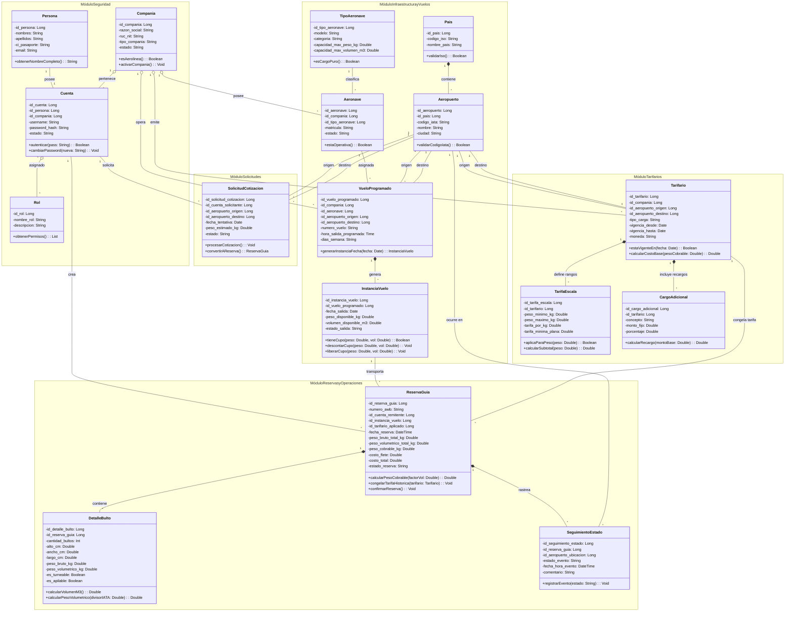

# expediente-arq-escalera
Expediente de Arquitectura - Seguimiento de Carga (Logística)

* **Estudiante:** [Escalera brayan]
* **Materia:** Arquitectura de Software · UAB · Gestión 2026-2
* **Docente:** Ing. Josue Chura
* **Variante asignada:** Variante 3 — Logística ("Seguimiento de carga")
* 

# Documento de Entrega H1 - Sistema Cargo

* **Estudiante:** [Escalera brayan]
* **Variante:** Sistema de Reservas, Tarifarios y Control de Carga Logística Aérea

---

## 1. Información General y Variante
El presente proyecto tiene como objetivo desarrollar la arquitectura base para la plataforma **Cargo**, enfocada en la gestión comercial, operativa y tarifaria de carga aérea para agencias y aerolíneas.

---

## 2. Actores del Sistema
* **Cliente / Agente de Carga (Forwarder):** Usuario externo que consulta rutas disponibles, solicita cotizaciones, realiza reservas de capacidad de carga y da seguimiento en tiempo real al estado de sus guías aéreas (AWB).
* **Personal Operativo (Aerolínea / Agente):** Usuario interno encargado de la programación de rutas, tramos de vuelo, administración de la flota de aeronaves, ajuste de tarifarios dinámicos y registro de eventos operacionales.
* **Administrador del Sistema:** Encargado del control global de acceso, gestión de compañías (Agencias de Carga y Aerolíneas), administración de usuarios y asignación de roles (RBAC).

---

## 3. Inventario de Módulos y Responsabilidades
* **Módulo `segu` (Seguridad y Control de Acceso):** Controla las identidades de los usuarios, administración de compañías y asignación de permisos bajo el esquema RBAC.
* **Módulo `aero` (Infraestructura, Geografía y Vuelos):** Gestiona el catálogo de países, la red de aeropuertos, la tipificación y flota de aeronaves, y la generación dinámica de itinerarios e instancias de vuelo.
* **Módulo `tari` (Tarifarios y Precios Dinámicos):** Administra las matrices de tarifas por ruta, tipo de carga y rangos de peso, asegurando la vigencia temporal sin modificar transacciones pasadas.
* **Módulo `carg` (Reservas, Operaciones y Tracking):** Administra la emisión de guías aéreas (AWB), la cubicación detallada de bultos ($GW$, $VW$, propiedades apilables/giratorias), el descuento dinámico de capacidad ($kg$ y $m^3$) y el seguimiento de eventos.
* **Módulo `soli` (Solicitudes Comerciales):** Permite procesar peticiones de cotización previa antes de consolidarse en una reserva definitiva.

---

## 4. Primer Diagrama de Clases UML

---

## 5. Atributos de Calidad Críticos y Líneas de Defensa

* **Consistencia e Integridad de Capacidad (Integridad Logística):**
  * **Línea de defensa 1 (Nivel Dominio/Clase):** La entidad `InstanciaVuelo` expone el método `tieneCupo(peso, vol)`, verificando atómicamente la disponibilidad de espacio real antes de aceptar cualquier confirmación.
  * **Línea de defensa 2 (Nivel Transaccional):** Al momento de emitir una `ReservaGuia`, la capacidad requerida es descontada inmediatamente mediante el método `descontarCupo()`, evitando sobre-reservas (*overbooking*) en vuelos de alta demanda.

* **Invariabilidad Dinámica de Tarifas (Trazabilidad Financiera Histórica):**
  * **Línea de defensa 1 (Nivel Estructural):** La entidad `ReservaGuia` congelará los valores definitivos (`peso_cobrable_kg`, `costo_flete`, `costo_total`) al momento de la emisión mediante `congelarTarifaHistorica()`.
  * **Línea de defensa 2 (Nivel Tarifario):** Las modificaciones futuras en los rangos de `TarifaEscala` o la actualización de un `Tarifario` por parte de las aerolíneas utilizan rangos de vigencia estricta (`vigencia_desde`, `vigencia_hasta`), manteniendo intactos los datos de las guías ya emitidas.
