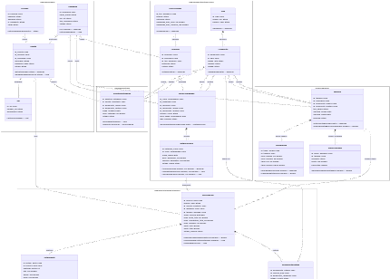
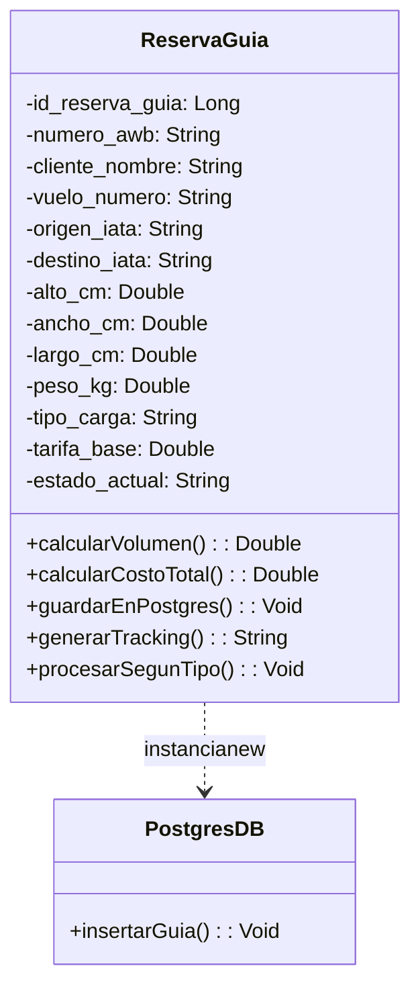
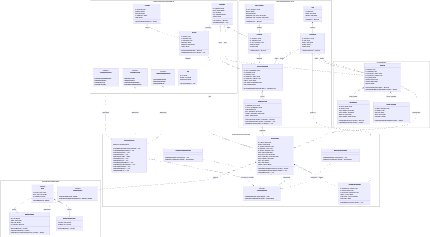

# Hitos de Arquitectura 2 (H2): Refactorización SOLID - Sistema Air Cargo (AWB)

Este entregable documenta la evolución de la arquitectura del sistema de reservas y rastreo de carga aérea (_Air Cargo / AWB_), pasando de un modelo inicial monolítico y acoplado (H1) a una arquitectura modular y mantenible guiada por los principios **SOLID**.

---

## 1. Diagrama ANTES (Modelo Inicial H1 con Problemas de Diseño)

En esta primera versión se identifican violaciones claras a los principios de diseño: `ReservaGuia` actúa como una **clase gorda** asumiendo la gestión de bultos, tarifas y rastreo; existen acoplamientos directos con instanciación rígida (`new`) hacia la base de datos y un manejo ineficiente de tipos de carga.





## 2. Diagrama DESPUÉS (Modelo Arquitectónico Final con SOLID Aplicado)

```mermaid
classDiagram
    direction TB

    namespace ModuloSeguridadYContratosRBAC {
        class IConsultorReserva {
            <<interface>>
            +consultarRutasDisponibles()*
            +solicitarCotizacion()*
            +realizarReserva()*
            +rastrearGuiaAWB()*
        }

        class IOperadorCarga {
            <<interface>>
            +programarVuelo()*
            +administrarFlota()*
            +ajustarTarifarioDinamico()*
            +registrarEventoOperacional()*
        }

        class IAdministradorSistema {
            <<interface>>
            +gestionarCompania()*
            +administrarUsuario()*
            +asignarRolRBAC()*
        }

        class Compania {
            -id_compania: Long
            -razon_social: String
            -ruc_nit: String
            -tipo_compania: String
            -estado: String
            +esAerolinea(): Boolean
            +activarCompania(): Void
        }

        class Persona {
            -id_persona: Long
            -nombres: String
            -apellidos: String
            -ci_pasaporte: String
            -email: String
            +obtenerNombreCompleto(): String
        }

        class Cuenta {
            -id_cuenta: Long
            -id_persona: Long
            -id_compania: Long
            -username: String
            -password_hash: String
            -estado: String
            +autenticar(pass: String): Boolean
            +cambiarPassword(nueva: String): Void
        }

        class Rol {
            -id_rol: Long
            -nombre_rol: String
            -descripcion: String
            +obtenerPermisos(): List
        }
    }

    namespace ModuloInfraestructuraYVuelos {
        class Pais {
            -id_pais: Long
            -codigo_iso: String
            -nombre_pais: String
            +validarIso(): Boolean
        }

        class Aeropuerto {
            -id_aeropuerto: Long
            -id_pais: Long
            -codigo_iata: String
            -nombre: String
            -ciudad: String
            +validarCodigoIata(): Boolean
        }

        class TipoAeronave {
            -id_tipo_aeronave: Long
            -modelo: String
            -categoria: String
            -capacidad_max_peso_kg: Double
            -capacidad_max_volumen_m3: Double
            +esCargoPuro(): Boolean
        }

        class Aeronave {
            -id_aeronave: Long
            -id_compania: Long
            -id_tipo_aeronave: Long
            -matricula: String
            -estado: String
            +estaOperativa(): Boolean
        }

        class VueloProgramado {
            -id_vuelo_programado: Long
            -id_compania: Long
            -id_aeronave: Long
            -id_aeropuerto_origen: Long
            -id_aeropuerto_destino: Long
            -numero_vuelo: String
            -hora_salida_programada: Time
            -dias_semana: String
            +generarInstanciaFecha(fecha: Date): InstanciaVuelo
        }

        class InstanciaVuelo {
            -id_instancia_vuelo: Long
            -id_vuelo_programado: Long
            -fecha_salida: Date
            -peso_disponible_kg: Double
            -volumen_disponible_m3: Double
            -estado_salida: String
            +tieneCupo(peso: Double, vol: Double): Boolean
            +descontarCupo(peso: Double, vol: Double): Void
            +liberarCupo(peso: Double, vol: Double): Void
        }
    }

    namespace ModuloTarifarios {
        class Tarifario {
            -id_tarifario: Long
            -id_compania: Long
            -id_aeropuerto_origen: Long
            -id_aeropuerto_destino: Long
            -tipo_carga: String
            -vigencia_desde: Date
            -vigencia_hasta: Date
            -moneda: String
            +estaVigenteEn(fecha: Date): Boolean
            +calcularCostoBase(pesoCobrable: Double): Double
        }

        class TarifaEscala {
            -id_tarifa_escala: Long
            -id_tarifario: Long
            -peso_minimo_kg: Double
            -peso_maximo_kg: Double
            -tarifa_por_kg: Double
            -tarifa_minima_plana: Double
            +aplicaParaPeso(peso: Double): Boolean
            +calcularSubtotal(peso: Double): Double
        }

        class CargoAdicional {
            -id_cargo_adicional: Long
            -id_tarifario: Long
            -concepto: String
            -monto_fijo: Double
            -porcentaje: Double
            +calcularRecargo(montoBase: Double): Double
        }
    }

    namespace ModuloDominioCargaYBultos {
        class Bulto {
            <<abstract>>
            -id_detalle_bulto: Long
            -peso_bruto_kg: Double
            -es_apilable: Boolean
            +getPesoBrutoKg()* Double
        }

        class Volumetricable {
            <<interface>>
            +calcularVolumenM3()* Double
            +calcularPesoVolumetrico(divisorIATA: Double)* Double
        }

        class BultoEstandar {
            -alto_cm: Double
            -ancho_cm: Double
            -largo_cm: Double
            -es_turneable: Boolean
            +getPesoBrutoKg(): Double
            +calcularVolumenM3(): Double
            +calcularPesoVolumetrico(divisorIATA: Double): Double
        }

        class BultoLiquidoGranel {
            -volumen_litros: Double
            -densidad_kg_l: Double
            +getPesoBrutoKg(): Double
        }
    }

    namespace ModuloServiciosYPersistencia {
        class ServicioReserva {
            -guiaRepo: IGuiaRepository
            +confirmarReserva(guia: ReservaGuia): Void
            +consultarRutasDisponibles(): List
            +solicitarCotizacion(): Void
            +realizarReserva(): Void
            +rastrearGuiaAWB(): String
            +programarVuelo(): Void
            +administrarFlota(): Void
            +ajustarTarifarioDinamico(): Void
            +registrarEventoOperacional(): Void
            +gestionarCompania(): Void
            +administrarUsuario(): Void
            +asignarRolRBAC(): Void
        }

        class IGuiaRepository {
            <<interface>>
            +guardarGuia(guia: ReservaGuia)*: Void
            +buscarPorAWB(numero: String)*: ReservaGuia
        }

        class PostgresGuiaRepository {
            +guardarGuia(guia: ReservaGuia): Void
            +buscarPorAWB(numero: String): ReservaGuia
        }

        class MockGuiaRepository {
            +guardarGuia(guia: ReservaGuia): Void
            +buscarPorAWB(numero: String): ReservaGuia
        }

        class ReservaGuia {
            -id_reserva_guia: Long
            -numero_awb: String
            -id_cuenta_remitente: Long
            -id_instancia_vuelo: Long
            -id_tarifario_aplicado: Long
            -fecha_reserva: DateTime
            -peso_bruto_total_kg: Double
            -peso_volumetrico_total_kg: Double
            -peso_cobrable_kg: Double
            -costo_flete: Double
            -costo_total: Double
            -estado_reserva: String
            +calcularPesoCobrable(factorVol: Double): Double
            +congelarTarifaHistorica(tarifario: Tarifario): Void
            +confirmarReserva(): Void
        }

        class SeguimientoEstado {
            -id_seguimiento_estado: Long
            -id_reserva_guia: Long
            -id_aeropuerto_ubicacion: Long
            -estado_evento: String
            -fecha_hora_evento: DateTime
            -comentario: String
            +registrarEvento(estado: String): Void
        }
    }

    %% Relaciones
    Persona "1" -- "1" Cuenta : posee
    Compania "1" o-- "*" Cuenta : pertenece
    Cuenta "*" o-- "*" Rol : asignado

    Pais "1" *-- "*" Aeropuerto : contiene
    TipoAeronave "1" -- "*" Aeronave : clasifica
    Compania "1" o-- "*" Aeronave : posee
    Compania "1" o-- "*" VueloProgramado : opera
    Aeronave "1" -- "*" VueloProgramado : asignada
    Aeropuerto "1" -- "*" VueloProgramado : origen
    Aeropuerto "1" -- "*" VueloProgramado : destino
    VueloProgramado "1" *-- "*" InstanciaVuelo : genera

    Compania "1" o-- "*" Tarifario : emite
    Aeropuerto "1" -- "*" Tarifario : origen
    Aeropuerto "1" -- "*" Tarifario : destino
    Tarifario "1" *-- "*" TarifaEscala : define rangos
    Tarifario "1" *-- "*" CargoAdicional : incluye recargos

    Bulto <|-- BultoEstandar : hereda
    Bulto <|-- BultoLiquidoGranel : hereda
    Volumetricable <|.. BultoEstandar : implementa

    IConsultorReserva <|.. ServicioReserva : implementa
    IOperadorCarga <|.. ServicioReserva : implementa
    IAdministradorSistema <|.. ServicioReserva : implementa

    ServicioReserva --> IGuiaRepository : depende del contrato
    PostgresGuiaRepository ..|> IGuiaRepository : implementa
    MockGuiaRepository ..|> IGuiaRepository : implementa

    Cuenta "1" -- "*" ReservaGuia : crea
    InstanciaVuelo "1" -- "*" ReservaGuia : transporta
    Tarifario "1" -- "*" ReservaGuia : congela tarifa
    ReservaGuia "1" *-- "*" Bulto : contiene
    ReservaGuia "1" *-- "*" SeguimientoEstado : rastrea
    Aeropuerto "1" -- "*" SeguimientoEstado : ocurre en

```

El sistema refactorizado se organiza en 5 módulos desacoplados (_namespaces_), con contratos explícitos (`<<interface>>`), clases abstractas y desacoplamiento de persistencia.





---

## 3. Justificación del Cambio y Principios Aplicados

Para resolver la clase monolítica inicial, se dividio la responsabilidad de `ReservaGuia` delegando el detalle físico a `Bulto`, el precio a `Tarifario` y el histórico a `SeguimientoEstado` en cumplimiento del principio **SRP (Single Responsibility)**. Extendimos la lógica tarifaria con `TarifaEscala` y `CargoAdicional` para permitir variaciones de precios sin modificar la reserva existente, satisfaciendo el principio **OCP (Open/Closed)**. Refactorizamos la jerarquía de cargas declarando la clase abstracta `Bulto` y segregando las dimensiones en la interfaz `Volumetricable`, evitando forzar métodos o atributos inválidos en cargas líquidas (`BultoLiquidoGranel`) como lo exige **LSP (Liskov Substitution)**. Asimismo, dividimos los permisos del sistema en interfaces RBAC pequeñas (`IConsultorReserva`, `IOperadorCarga`, `IAdministradorSistema`), asegurando que ningún cliente dependa de operaciones no autorizadas bajo **ISP (Interface Segregation)**. Finalmente, desacoplamos el servicio de la base de datos mediante la interfaz `IGuiaRepository`, permitiendo alternar entre `PostgresGuiaRepository` y `MockGuiaRepository` y garantizando que la lógica de negocio dependa exclusivamente de abstracciones como manda **DIP (Dependency Inversion)**.

```

```
