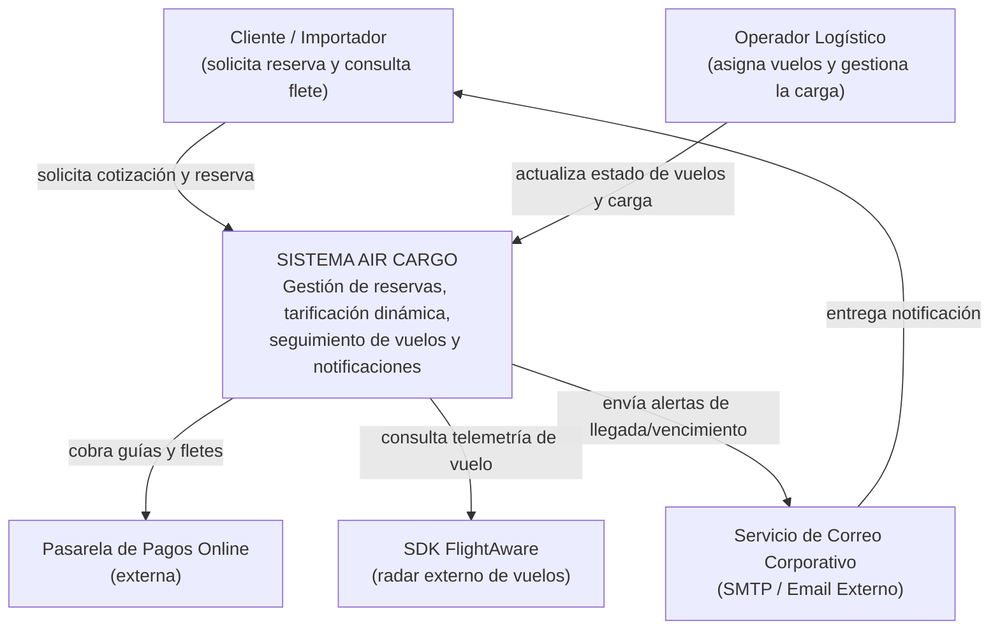
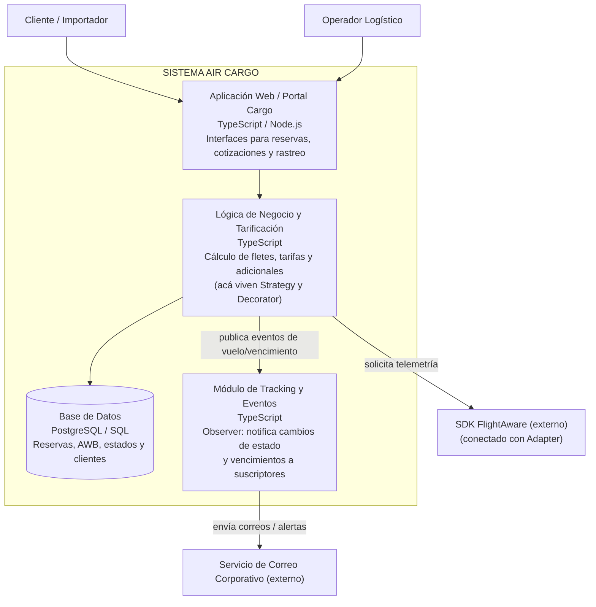

# C4 del caso AIR CARGO — Sistema de Gestión de Carga Aérea (H4 - Parte B)

Este archivo contiene la documentación de arquitectura del sistema **Air Cargo**, modelada mediante los Niveles 1 y 2 del estándar C4 en sintaxis Mermaid.

---

## Nivel 1 — Contexto

Mapeo global del sistema Air Cargo, identificando los actores principales y sus integraciones con servicios externos.

### Descripción del Entorno

* **Actores del Sistema:**
* **Cliente / Importador:** Usuario que solicita la cotización, agrega servicios adicionales a su carga y consulta el estado del envío.
* **Operador Logístico:** Usuario interno encargado del itinerario de vuelos, asignación de guías aéreas (AWB) y actualización de estados.

* **Sistemas Externos Integrados:**
* **SDK FlightAware:** Proveedor de telemetría y radar de vuelo en tiempo real.
* **Pasarela de Pagos:** Plataforma de procesamiento financiero para el cobro del flete y servicios agregados.
* **Servicio de Correo Corporativo (SMTP):** Canal externo de mensajería para el envío automático de alertas, comprobantes y guías aéreas.

---

## Nivel 2 — Contenedores

Desglose interno de los contenedores ejecutables, servicios de lógica de negocio y almacenes de datos que conforman Air Cargo.

### Mapeo de Componentes e Implementación de Patrones

* **Portal Cargo (Web App):** Interfaz cliente-servidor que expone las pantallas de gestión y cotización.
* **Lógica de Negocio y Tarificación:** Contenedor donde se ejecuta el cálculo de fletes. Integra los patrones **Strategy** (cálculo de tarifa por peso/volumen/distancia) y **Decorator** (adición dinámica de aditivos como seguros o embalaje frágil).
* **Módulo de Tracking y Eventos:** Servicio desacoplado que implementa el patrón **Observer** para emitir eventos reactivos cuando un vuelo cambia de estado o vence la reserva.
* **Integraciones Externas:** Las llamadas hacia FlightAware, Pasarela de Pagos y Correo Corporativo se aíslan mediante el patrón **Adapter**.
* **Base de Datos:** Almacén persistente estructurado para el registro de guías aéreas (AWB), reservas y clientes.
