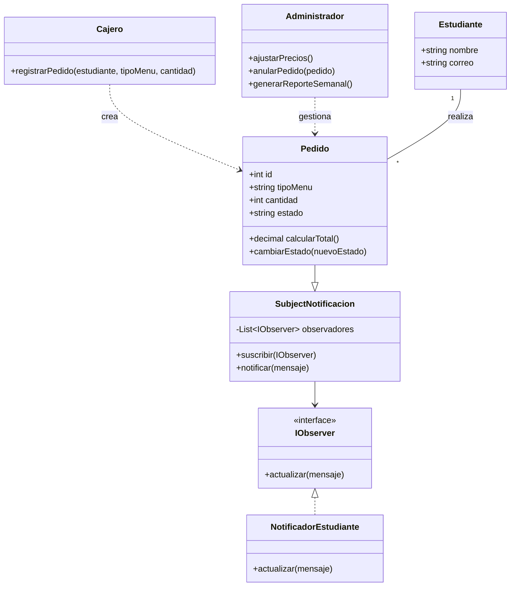

# Diagrama de Clases — Comedor Universitario "Sabor Andino"

> Autor: [escalera choque kevin brayan]

```mermaid
classDiagram
    class Estudiante {
        +string nombre
        +string correo
    }

    class Pedido {
        +int id
        +string tipoMenu
        +int cantidad
        +string estado
        +decimal calcularTotal()
        +cambiarEstado(nuevoEstado)
    }

    class Cajero {
        +registrarPedido(estudiante, tipoMenu, cantidad)
    }

    class Administrador {
        +ajustarPrecios()
        +anularPedido(pedido)
        +generarReporteSemanal()
    }

    class SubjectNotificacion {
        -List~IObserver~ observadores
        +suscribir(IObserver)
        +notificar(mensaje)
    }

    class IObserver {
        <<interface>>
        +actualizar(mensaje)
    }

    class NotificadorEstudiante {
        +actualizar(mensaje)
    }

    IObserver <|.. NotificadorEstudiante
    SubjectNotificacion --> IObserver
    Pedido --|> SubjectNotificacion
    Cajero ..> Pedido : crea
    Administrador ..> Pedido : gestiona
    Estudiante "1" -- "*" Pedido : realiza
```
