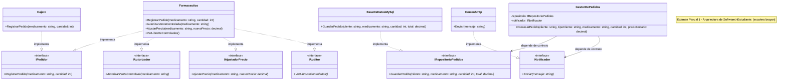

# P1.3 - Diagrama de Clases (Después de Refactorización)

```mermaid
classDiagram
    note "Examen Parcial 1 - Arquitectura de Software\nEstudiante: [escalera brayan]"

    class IPedidor {
        <<interface>>
        +RegistrarPedido(medicamento: string, cantidad: int)*
    }

    class IAutorizador {
        <<interface>>
        +AutorizarVentaControlada(medicamento: string)*
    }

    class IAjustadorPrecio {
        <<interface>>
        +AjustarPrecio(medicamento: string, nuevoPrecio: decimal)*
    }

    class IAuditor {
        <<interface>>
        +VerLibroDeControlados()*
    }

    class IRepositorioPedidos {
        <<interface>>
        +GuardarPedido(cliente: string, medicamento: string, cantidad: int, total: decimal)*
    }

    class INotificador {
        <<interface>>
        +Enviar(mensaje: string)*
    }

    class Farmaceutico {
        +RegistrarPedido(medicamento: string, cantidad: int)
        +AutorizarVentaControlada(medicamento: string)
        +AjustarPrecio(medicamento: string, nuevoPrecio: decimal)
        +VerLibroDeControlados()
    }

    class Cajero {
        +RegistrarPedido(medicamento: string, cantidad: int)
    }

    class BaseDeDatosMySql {
        +GuardarPedido(cliente: string, medicamento: string, cantidad: int, total: decimal)
    }

    class CorreoSmtp {
        +Enviar(mensaje: string)
    }

    class GestorDePedidos {
        -repositorio: IRepositorioPedidos
        -notificador: INotificador
        +ProcesarPedido(cliente: string, tipoCliente: string, medicamento: string, cantidad: int, precioUnitario: decimal)
    }

    Farmaceutico ..|> IPedidor : implementa
    Farmaceutico ..|> IAutorizador : implementa
    Farmaceutico ..|> IAjustadorPrecio : implementa
    Farmaceutico ..|> IAuditor : implementa
    Cajero ..|> IPedidor : implementa

    BaseDeDatosMySql ..|> IRepositorioPedidos : implementa
    CorreoSmtp ..|> INotificador : implementa
    GestorDePedidos --> IRepositorioPedidos : depende de contrato
    GestorDePedidos --> INotificador : depende de contrato
```
