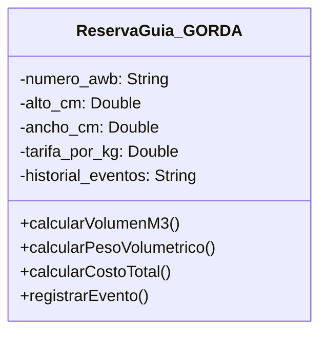
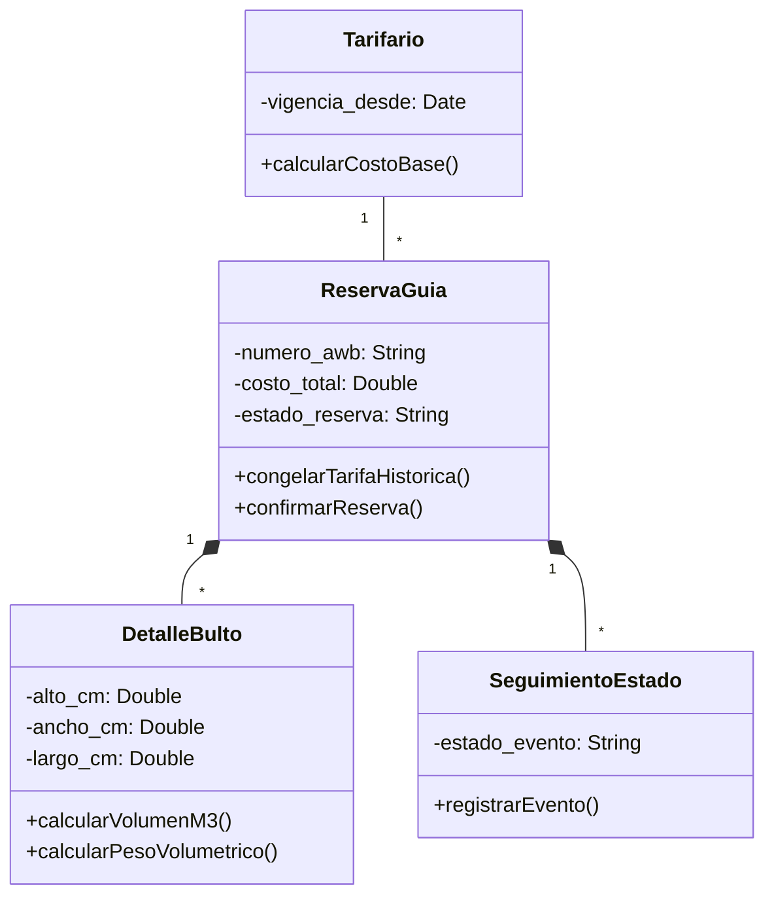

````markdown
# Práctica C4: Principios SOLID (S - Single Responsibility & O - Open/Closed)

## 1. Identificación y Solución de Clase Gorda (Principio S - SRP)

### El Antes (Diseño con Clase Gorda)

En el modelo inicial legado (`treserva`), la clase `ReservaGuia` acumulaba múltiples responsabilidades violando el principio de **Single Responsibility (SRP)**:

- Gestión física de bultos (dimensiones, cubicaje $GW/VW$, apilabilidad).
- Lógica financiera (cálculo de precios, tarifas y sobrecargas).
- Seguimiento de estado y auditoría.


````

### El Después (Refactorización SRP Aplicada)

Se eliminó la clase gorda distribuyendo las responsabilidades en entidades especializadas con una sola razón para cambiar:



---

## 2. Justificación de los Principios Aplicados

- **Principio S (Single Responsibility):** Cada clase tiene una sola área de impacto (`DetalleBulto` para Bodega, `Tarifario` para Finanzas, `SeguimientoEstado` para Atención al Cliente y `ReservaGuia` para la Operación del Contrato).
- **Principio O (Open/Closed):** Las tarifas y recargos pueden extenderse añadiendo nuevos tipos en `CargoAdicional` o escalas en `TarifaEscala` sin alterar la estructura base de `ReservaGuia`.

```

```
