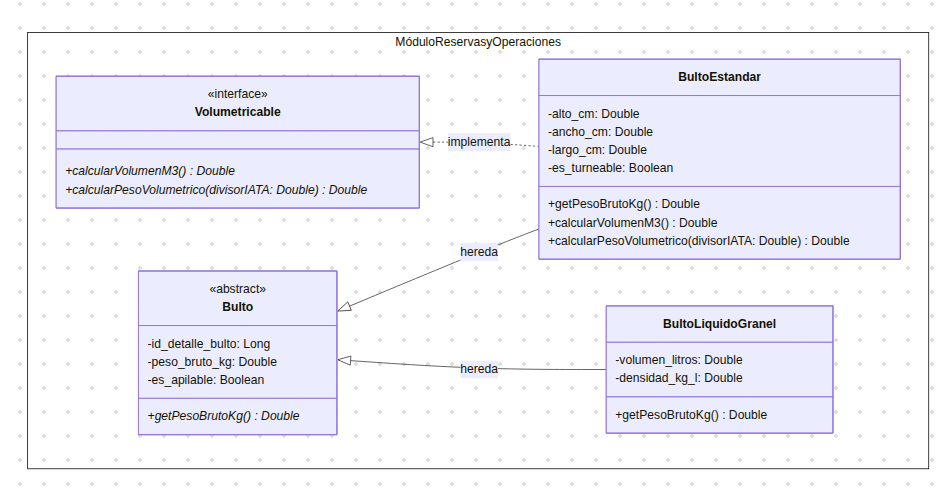
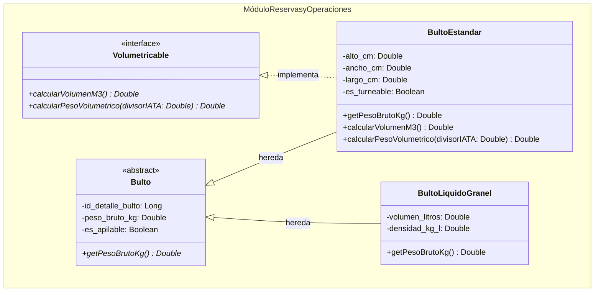

# Práctica C4: Principios SOLID (L - Liskov Substitution & I - Interface Segregation)

## 1. Identificación del Problema: La "Herencia Mentirosa"

### Contexto del Dominio

En la arquitectura inicial de gestión de guías aéreas (AWB), la entidad `DetalleBulto` pertenece a la **Capa de Dominio / Modelo de Datos**. Esta clase asumía un comportamiento rígido donde todo paquete o envío posee dimensiones rectangulares u ortoédricas ($alto \times ancho \times largo$) y calcula su cubicaje mediante una fórmula volumétrica IATA fija.

### Planteamiento del Fallo (Violación de LSP y ISP)

Si el negocio requiere soportar **cargas no habituales** (como líquidos a granel transportados en flexitanks o maquinaria de forma irregular), crear una jerarquía rígida donde todos hereden de un contrato con mediciones de caja obligatorias genera una **herencia mentirosa**:

- **Violación de Liskov (LSP):** Una clase como `BultoLiquidoGranel` no tiene dimensiones de aristas. Si heredara un método obligatorio como `calcularPesoVolumetrico()`, se vería forzada a retornar valores ficticios ($0$) o lanzar una excepción (`NotImplementedException`), rompiendo la sustitución transparente respecto al padre.
- **Violación de Segregación de Interfaces (ISP):** Se obligaría a tipos de carga especiales a depender de métodos de cubicaje dimensional que no utilizan, **contaminando el objeto de negocio con métodos basura que generan incoherencias de herencia**.

---

## 2. Solución Aplicada (Contrato Mínimo + Interfaz Segregada)

Para solucionar el problema a nivel de **Capa de Dominio** sin alterar la base del sistema, se aplicó una refactorización basada en la desacoplación de responsabilidades:

1. **Clase Abstracta Padre (`Bulto`):** Mantiene únicamente el **contrato mínimo universal** que absolutamente todos los envíos aéreos cumplen sin excepción (el identificador, apilabilidad y el reporte de su peso físico real mediante `getPesoBrutoKg()`).
2. **Interfaz Segregada (`Volumetricable`):** Aísla la capacidad opcional de medir dimensiones físicas rectangulares.
3. **Especialización por Subtipos:**
   - `BultoEstandar`: **Hereda** de `Bulto` (cumple con ser un envío y tener peso real) e **implementa `Volumetricable`** (posee dimensiones de caja).
   - `BultoLiquidoGranel`: **Hereda** de `Bulto` (es un envío con peso real) pero **NO implementa `Volumetricable`** (no tiene aristas rectangulares, calcula su peso mediante volumen en litros y densidad).

---

## 3. Diagrama de Clases de la Solución

